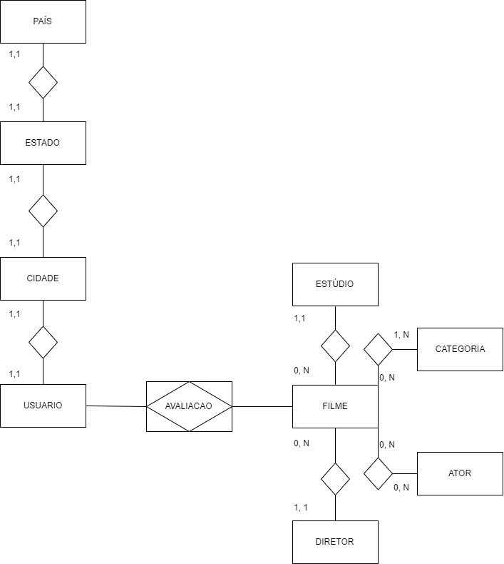

# RateMe
Implementação de um banco relacional e não relacional de um sistema de avaliação de filmes.

---

## Especificação do minimundo

RateME é um sistema que deve permitir que usuários cadastrados possam obter informações sobre os filmes cadastrados, Filmes são cadastrados com um nome, uma data de lançamento, a quantidade de bileteria, sua categoria e informações sobre o estudio que o produziu e seu diretor, um filme só pode ser produzido por um estudio e por um diretor. 
Um estúdio contem um nome e suas informações de localidade (cidade, estado, país). 
Um diretor possui um nome, sua idade e a informação sobre qual é o pais de seu nascimento. 
O sistema ainda deve armazenar as informações de cadastro de usuários, sendo estas seu nome completo, seu nome de usuário (escolhido ao fazer o cadastro), seu e-mail, a data em que se registrou no site e seu pais de origem. 
Um usuário deve poder dar notas aos filmes que desejar, deve ser apenas armazenada a informação de quando o usuário fez essa avaliação para controle.

### ER



### Relatório

Após identificar o tema do trabalho, que é o sistema de avaliação de filmes, começamos a desenvolver o banco relacional, o qual já conhecemos, até mesmo para ter uma base do que precisaria ser replicado para um banco não relacional.

Logo depois dessa construção, escolhemos o MongoDB por se tratar de um banco muito em evidência hoje no mercado e que nenhum de nós havíamos mexido anteriormente, então se tratava de um mundo novo, que sempre é bom aprender. Apesar de pensar em usar o HBase, no qual um integrante já tinha uma familiaridade, a configuração do HBase requer um sistema muito bem definido e integrado para começar o desenvolvimento. Partimos da simplicidade.

Por fim, por se tratar de uma linguagem nova para nós, sentimos um pouco de dificuldade na sintaxe e na construção do relacionamento entre os diferentes documentos, mas com a continuidade no desenvolvimento, esses entraves foram sendo solucionados.

Para realizar a construção dos documentos no MongoDB basta inserir os comandos presentes no documento acima, na seção do NOSQL (create_docs_rateme.js). E dessa mesma forma são realizadas as querys, contidas na seção QUERYS no documento (x).

---

### Rodando projeto

Basta ter Docker e docker-compose em sua máquina e executar o seguinte comando

```
docker-compose up --build -d
```

Depois desse passo o MongoDB estará rodando na porta 27017 e o Mysql na 3606 da sua máquina.

#### Executando as consultas

[Aqui estão as 10 queries](./NoSQL/README.md) para executar no MongoDB.

Alternativas:

1. Você pode conectar ao mongo com qualquer client de preferência na porta 27017. 

    Ex: [Robo3T](https://robomongo.org/download)

2. Conectar direto no bash do terminal que roda o mongo.

    1. Digite o comando para abrir o shell.
        ```
        docker exec -ti <ID DO CONTAINER> mongo
        ```
    2. Daí use a documentação para fazer queries.
    
        [Documentação do mongo para consultas](https://docs.mongodb.com/manual/crud/#read-operations)

#### Conectando no MYSQL

Alternativas:

1. Usar um client e conectar na porta padrão (3306).

    Ex.: [MYSQL workbench](https://www.mysql.com/products/workbench/) que fornece uma interface amigável para gerenciar o banco de dados.

2. Conectar direto no terminal do container mysql
    1. Digite o comando para abrir o shell. Se falhar, troque "/bin/bash" por "bash".
        ```
        docker exec -ti <ID DO CONTAINER> /bin/bash
        ```
    2. Inicie o mysql com o seguinte comando
        ```
        mysql -uroot -p
        ```
    3. Use o banco de dados em questão
        ```
        use RATEME;
        ```
    4. Teste para ver se as tabelas vão aparecer
        ```
        show tables;
        ```
    5. A partir daí pode executar qualquer comando
